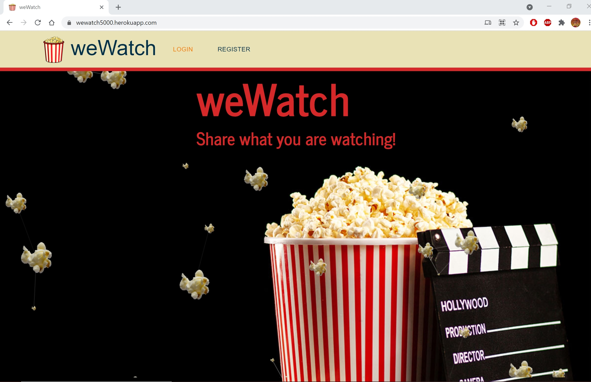
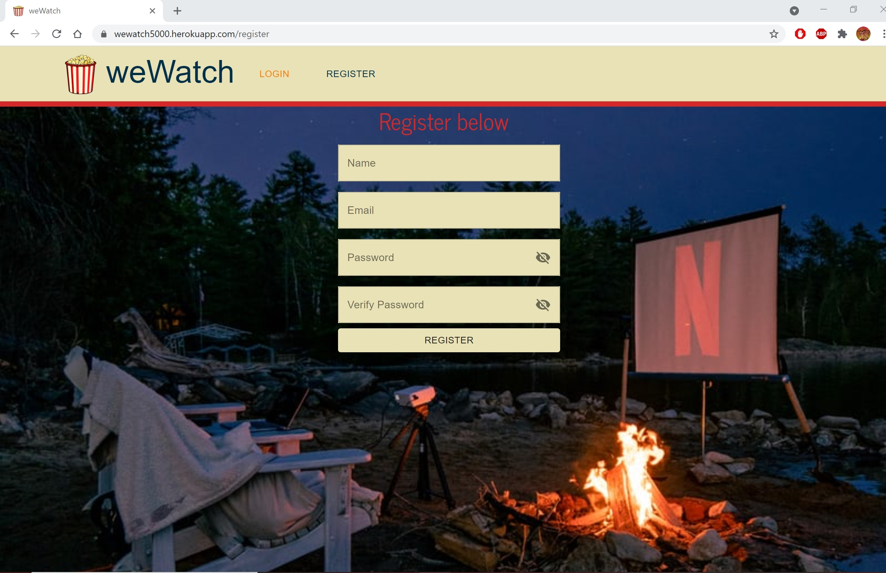
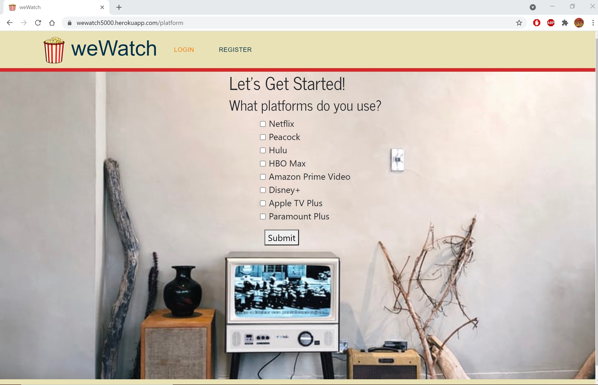

# weWatch
weWatch is a MERN based social media app for sharing what you are watching, storing your favorite shows and streaming platforms, and following your friends to see what they are watching as well. This Full Stack Application utilizes MongoDB, Express, Node, React, Axios, Bcryptjs, LoDash, API.WatchMode.com, Material UI, Particlesjs, Passport, React-router-dom, Bootstrap, Validator, Bootstrap,  jsonwebtoken, and mongoose.

# Deployed
Live link deployed at https://wewatch5000.herokuapp.com/

# Screenshots

# User Story
As an avid consumer of movies and television, I would like an app that allows me to share what I am watching with a group of friends.  I would like for my friends to be able to see what I am watching and on what platform so that I can further discuss and interact with them about the movie or show.

## Table of Contents

* [Installation](#installation)
* [Usage](#usage)
* [Credits](#credits)
* [Contributing](#contributing)
* [Tests](#tests)
* [Future](#future)

## Installation
Please run npm i after cloning the repo

## Usage 
Run npm start after installing dependencies and pull up localhost:3000

## Credits
All Code was created by Diane Furlong, Nick Reese, Jordan Rantucci and Nakiyah Fears

## Contributing
Contributions in the form of suggestions or feedback are appreciated.

## Tests
There are no tests for this project.

## Future 

